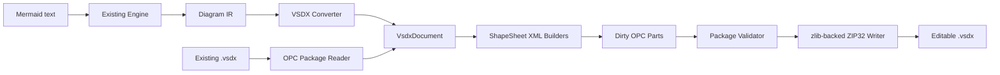
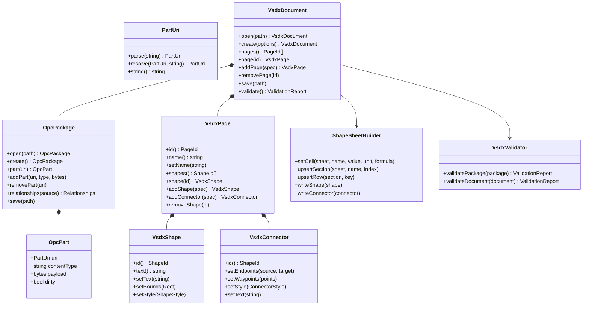
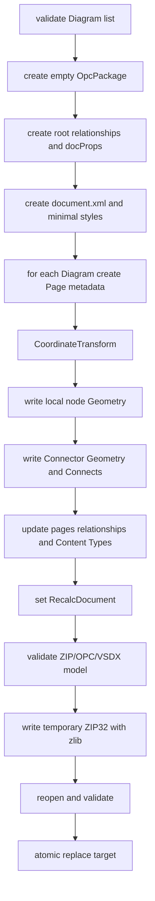
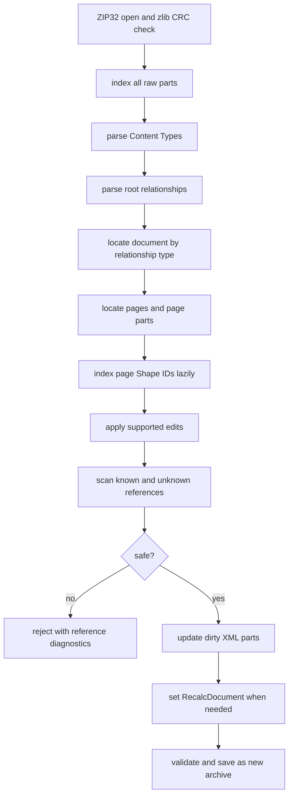

# mermaid-c VSDX 技术方案

> 日期: 2026-07-27 | 基于 spec.md v1.1.0（定版 v4）
>
> 状态: 当前实施方案。附录 A 为 1.0 Mermaid → IR 历史方案，不再控制 VSDX 实现。
>
> 实现映射（2026-08-05 重构后）：本文档中的类名为设计概念名，
> 对应实现已重构为分层结构：
>   - 序列化/部件工厂 → `src/vsdx/io/`（`XmlBuilder`/`DocumentParts`/`Validator`/`VsdxWriter`）；
>     读取链（`VsdxReader`/`Document::open`）已移出主库 → `tests/vsdx_reader.*`（仅测试/校对）
>   - 母版 → `src/vsdx/masters/`（`MasterLibrary`）；渲染 → `src/vsdx/render/`（`Renderer` 族）
>   - 内部模型 → `src/vsdx/model/`；协调者 → `detail::DocumentCore`
>   - Mermaid→IR → `src/parse/` + `src/app/`；公共 API 头保持 `src/mermaidc/vsdx.hpp`

---

## 1. 目标与约束

本方案在现有 Mermaid → SVG → Diagram IR 管线之后增加可靠的 VSDX 文档层。VSDX 层直接读写 ZIP/OPC/Visio XML，不调用 Microsoft Visio COM，并同时支持：

- 从一个或多个 `Diagram` 创建原生可编辑 VSDX。
- 打开已有 VSDX，修改受支持对象后保真写回。
- 多页、五种基础节点、文本、基础样式和带 Glue 的连接线。
- 节点形状与连接线均为**官方模具母版实例**（`Master="N"` + 实例局部覆盖），以获得官方行为（调整大小、连接点、右键菜单、线型切换 UI）。
- 初始连接路径遵循 IR waypoints，节点移动后允许 Visio 重路由。
- 未修改部件原始 payload 保留，未知 XML 在局部编辑时保留。

本期不修改 Mermaid 提取算法；现有 IR 是 VSDX 层的输入契约。

> **决策（2026-08-03 定版）**：统一采用「内置官方模具 → 按 `diagramType` 提取母版子集 → 打包进输出 VSDX」。
> 1. 形状**直接使用母版形状**（不再本地 Geometry），尺寸/位置通过实例 Cell 覆盖。
> 2. 不同图表类型搬入不同的母版组件集（按需子集，非全量）。
> 3. 模具资源**构建期嵌入**二进制。
> 4. 母版 **Icon 保留**（重新打开形状面板需要预览）。
> 5. `diagramType` 由调用方**显式传入** `CreateOptions`。

---

## 2. 总体架构



分层职责：

| 层 | 职责 | 不负责 |
|----|------|--------|
| Mermaid/IR | 解析、测量、布局、路径点提取 | VSDX ID、单位和 XML |
| OPC | ZIP Part、Content Type、Relationship、URI、安全和保存 | ShapeSheet 字段含义 |
| VSDX DOM | Document/Page/Shape/Connector 的受支持语义 | Mermaid 解析 |
| ShapeSheet Writer | Cell/Section/Row/Text/Connect 的一致写入 | ZIP 中央目录 |
| Validator | ZIP、OPC 和受支持 Visio 不变量 | 修复任意第三方损坏文件 |

---

## 3. 工程结构

```text
mermaid-c/
├── CMakeLists.txt
├── docs/
│   ├── spec.md
│   ├── implementation.md
│   ├── vsdx-format.md
│   └── phases/
│       ├── phase1-...md ... phase5-...md       # 已有 Mermaid 基线
│       ├── phase6-vsdx-opc-package.md
│       ├── phase7-vsdx-document-pages.md
│       ├── phase8-vsdx-shapes.md
│       ├── phase9-vsdx-connectors.md
│       ├── phase10-vsdx-edit-roundtrip.md
│       └── phase11-vsdx-api-validation.md
├── src/
│   ├── CMakeLists.txt
│   ├── mermaidc/
│   │   ├── ir.hpp
│   │   ├── mermaidc.hpp
│   │   └── vsdx.hpp                         # 新公开 API，无第三方类型
│   ├── opc/
│   │   ├── part_uri.hpp
│   │   ├── part_uri.cpp
│   │   ├── zip_archive.hpp
│   │   ├── zip_archive.cpp
│   │   ├── package.hpp
│   │   ├── package.cpp
│   │   ├── content_types.hpp
│   │   ├── content_types.cpp
│   │   ├── relationships.hpp
│   │   └── relationships.cpp
│   └── vsdx/
│       ├── document.cpp
│       ├── xml_names.hpp
│       ├── xml_part.hpp
│       ├── xml_part.cpp
│       ├── coordinate_transform.hpp
│       ├── coordinate_transform.cpp
│       ├── shape_sheet.hpp
│       ├── shape_sheet.cpp
│       ├── connector_router.hpp
│       ├── connector_router.cpp
│       ├── validator.hpp
│       ├── validator.cpp
│       ├── vsdx_writer.hpp                  # 旧便利接口兼容层
│       └── vsdx_writer.cpp
└── tests/
    ├── fixtures/vsdx/                       # 小型脱敏 fixture
    ├── test_opc_uri.cpp
    ├── test_opc_package.cpp
    ├── test_vsdx_document.cpp
    ├── test_vsdx_shapes.cpp
    ├── test_vsdx_connectors.cpp
    ├── test_vsdx_roundtrip.cpp
    └── test_vsdx.cpp                        # Mermaid 端到端测试
```

文件可以在实现中按复杂度合并，但 OPC、VSDX DOM、ShapeSheet 写入和验证的依赖方向不能倒置。

---

## 4. 依赖与 CMake

### 4.1 系统依赖

用户已确定使用系统库：

| 库 | 用途 | 公开头文件可见性 |
|----|------|------------------|
| `libxml2` | XML DOM/Reader/Writer、namespace 与 Processing Instruction 保留 | Private |
| `zlib` | IEEE CRC-32、raw Deflate/Inflate | Private |

CMake 基线：

```cmake
find_package(LibXml2 CONFIG REQUIRED)
find_package(ZLIB CONFIG REQUIRED COMPONENTS shared)

target_link_libraries(mermaidc
    PRIVATE
        LibXml2::LibXml2
        ZLIB::ZLIB
)
```

配置阶段必须明确报告缺失包和安装提示。ZIP32 容器属于项目源码，但 CRC 与 Deflate/Inflate 必须调用 zlib，不再保留当前错误的 CRC 或无压缩 Writer。

### 4.2 平台安装基线

| 平台 | 推荐来源 |
|------|----------|
| Windows | 通过 `CMAKE_PREFIX_PATH` 指向 libxml2 与 zlib 安装前缀 |
| Ubuntu/Debian | `libxml2-dev`、`zlib1g-dev` |
| Fedora | `libxml2-devel`、`zlib-devel` |
| macOS | Homebrew `libxml2`、`zlib` |

库的导出 CMake Config 在安装阶段需要使用 `find_dependency` 表达静态库的链接依赖。

---

## 5. 核心类设计

### 5.1 类关系



### 5.2 `PartUri`

职责：

- 解析并规范化 OPC Part URI。
- 拒绝绝对文件系统路径、反斜杠、空段和越界 `..`。
- 按源 Part URI 解析 Relationship Target。
- 提供关系部件 URI 与源部件 URI 的双向映射。

`PartUri` 一旦构造成功即保持规范形式，并可作为 `std::map` / `unordered_map` 的键。

### 5.3 `OpcPackage`

内部状态：

| 成员 | 说明 |
|------|------|
| `parts_` | `PartUri -> OpcPart`，保存原始 payload 与 dirty 状态 |
| `contentTypes_` | Default/Override 索引 |
| `relationships_` | 按可选 source PartUri 分组的 Relationship 集合 |
| `sourcePath_` | 打开已有文件时的源路径 |
| `limits_` | 条目数、单部件大小和总展开大小限制 |

关键行为：

- `open` 使用内部 `ZipArchive` 读取 Central Directory，并用 zlib Inflate/CRC 校验条目。
- 未修改 Part 不解析 XML。
- `save` 始终写入同目录临时文件，关闭并重新校验后再替换目标。
- 不在源包上原地提交修改，避免中途失败破坏原文件。

#### 5.3.1 `ZipArchive`

`ZipArchive` 是内部 ZIP32 容器，不属于 OPC 语义层。它支持 EOCD、Central Directory、Local File Header、Store（method 0）和 Deflate（method 8）。CRC 使用 zlib `crc32`，压缩流使用 raw Deflate/Inflate。

它明确拒绝 encryption、ZIP64、multi-disk、未知压缩方法、重复文件名和越界或重叠数据区。写入时预先计算 CRC 与大小，在 Local Header 和 Central Directory 中写入确定值，不生成 Data Descriptor。

### 5.4 `ContentTypes` 与 `Relationships`

`ContentTypes` 提供：

- `contentTypeFor(partUri)`。
- `addOverride` / `removeOverride`。
- `ensureDefault`。
- 引用不存在 Part 的检查。

`Relationships` 提供：

- Relationship ID 的局部分配。
- 按 ID、Type、Target 查询。
- Internal Target 解析和存在性验证。
- External Target 的只读保存。

### 5.5 `XmlPart`

`XmlPart` 是 `OpcPart` 的按需视图：

```text
raw payload
    --首次需要修改--> libxml2 tree
  --修改--> dirty=true
  --保存--> UTF-8 XML payload
```

加载使用 `xmlReadMemory` 的非网络模式，保留注释和 Processing Instruction；保存使用 `xmlSaveToBuffer`。libxml2 节点直接区分 local name 与 `xmlNs`，因此 `xml_names.hpp` 提供：

- namespace URI + local name 比较。
- 按 in-scope namespace 查找或创建 `xmlNs`。
- 创建元素时复用当前文档前缀和默认命名空间。

不使用裸字符串 XPath 假定固定前缀；外部实体和网络访问始终禁用。

### 5.6 `VsdxDocument`

`VsdxDocument` 为 move-only PIMPL 类型，公共头文件不暴露 libxml2/zlib。实现持有：

- `OpcPackage`。
- Document、Pages 和 Page Part 的关系索引。
- Page ID、Shape ID 与逻辑 ID 分配器。
- 已解析 Page 对象。
- 打开时基线诊断和当前诊断。

Page/Shape/Connector 由 Document 所有。公开引用在对应对象被删除后失效；API 同时提供稳定数字 ID，调用方不需要长期保存 C++ 引用。

### 5.7 `CoordinateTransform`

输入：IR bounds、96 px/in、显式 outputScale 和页面边距。

```text
scale = outputScale / 96.0
X = left + (x - minX) * scale
Y = bottom + (maxY - y) * scale
```

输出：PageWidth、PageHeight、节点中心与尺寸、Connector 页面路径点。所有数值通过统一 `NumberFormatter` 使用 classic locale 和 `max_digits10` 精度序列化。

### 5.8 `ShapeSheetBuilder`

只通过结构化 DOM 写入 Cell/Section/Row：

- Cell 以 `N` 定位。
- Geometry Section 以 `N + IX` 定位。
- Row 以 Section 类型规定的 `N` 或 `IX` 定位。
- Geometry Row 同时检查 `T + IX`。
- 更新公式时同时更新 `V`，清理过期 `E`。
- 插入顺序遵守 Visio Schema。

### 5.9 `VsdxValidator`

诊断结构：

```cpp
enum class Severity { Warning, Error };

struct ValidationIssue {
    Severity severity;
    std::string code;
    std::string partUri;
    std::string xmlPath;
    std::string message;
};
```

创建新文档时任何 Error 阻止保存。编辑已有文档时记录打开基线；保存至少要保证不新增 Error，并对本次修改涉及的 Part 执行严格验证。

---

## 6. 公共 API 草案

```cpp
#pragma once

#include <mermaidc/ir.hpp>

#include <filesystem>
#include <memory>
#include <string>
#include <vector>

namespace mermaidc::vsdx {

using PageId = std::uint32_t;
using ShapeId = std::uint32_t;

struct CreateOptions {
    double outputScale = 1.0;
    double marginLeft = 0.5;
    double marginRight = 0.5;
    double marginTop = 0.5;
    double marginBottom = 0.5;
};

struct ShapeSpec;
struct ConnectorSpec;
struct ValidationReport;

class Shape;
class Connector;

class Page {
public:
    PageId id() const noexcept;
    std::string name() const;
    void setName(std::string name);

    std::vector<ShapeId> shapeIds() const;
    Shape& shape(ShapeId id);
    Connector& connector(ShapeId id);

    Shape& addShape(const ShapeSpec& spec);
    Connector& addConnector(const ConnectorSpec& spec);
    void removeShape(ShapeId id);
};

class Document {
public:
    static Document create(const CreateOptions& options = {});
    static Document fromDiagrams(
        const std::vector<Diagram>& diagrams,
        const CreateOptions& options = {});
    static Document open(const std::filesystem::path& path);

    Document(Document&&) noexcept;
    Document& operator=(Document&&) noexcept;
    ~Document();

    std::vector<PageId> pageIds() const;
    Page& page(PageId id);
    Page& addPage(std::string name);
    void removePage(PageId id);

    ValidationReport validate() const;
    void save(const std::filesystem::path& path);

private:
    class Impl;
    std::unique_ptr<Impl> impl_;
};

void writeVsdx(const std::filesystem::path& path, const Diagram& diagram);

} // namespace mermaidc::vsdx
```

最终签名允许在编码阶段做不改变能力边界的小调整。必须保留单个 `Diagram` 的便利写入接口，并让它委托 `Document::fromDiagrams`。

---

## 7. 新建文档流程



### 7.1 部件集合（含母版）

新建文档默认创建：

```text
[Content_Types].xml
_rels/.rels
docProps/app.xml
docProps/core.xml
docProps/custom.xml
visio/document.xml              # 含合并后的 StyleSheets（官方样式重映射 ID）
visio/_rels/document.xml.rels   # 引用 masters/pages/windows
visio/masters/masters.xml       # 按 diagramType 提取的母版索引（含 Icon）
visio/masters/masterN.xml       # 每个母版一个文件
visio/masters/_rels/masters.xml.rels
visio/pages/pages.xml
visio/pages/_rels/pages.xml.rels
visio/pages/pageN.xml
```

- 母版来源：**构建期嵌入**的内置官方模具（`builtin/` → `stencil_resources.cpp`）。
- 按 `diagramType` 选择模具并提取**母版子集**（见 §7.4 映射表），母版 ID/关系/ContentTypes 重写为新空间（从 100 起）。
- 母版 Shape 引用的 StyleSheets（含 Theme=6、Flow Normal=7、Connector=8 等）从模具 `document.xml` **合并**进输出 `document.xml`，并做 ID 重映射，避免与既有 0/3/4 冲突。
- 连接线使用官方 **Dynamic connector 母版**（`MasterType=541`），替代手写最小母版；否则 Visio 不提供「更改连接线类型」UI（经桌面 Visio 对比实验确认）。
- Theme、Thumbnail、pageN.xml.rels 仍不创建（除非未来引用图片等 Part）。

### 7.2 Page ID 和名称

- 新建文档 Page ID 从 0 递增。
- 页面名称优先使用调用方指定值，其次使用 `diagramType`，最后使用 `Page-N`。
- 重名按 `Name`, `Name.2`, `Name.3` 方式稳定消歧。
- `pages.xml` 中 Page 顺序等于输入顺序。
- `DocumentSettings.TopPage` 指向第一个 Page ID。

### 7.3 Shape ID

- 每页独立分配，选择当前最大 ID + 1，不复用已删除 ID。
- 创建节点后再创建 Connector，便于一次建立逻辑 ID 到 Shape ID 的映射。
- 重复逻辑节点 ID 在转换前报错。
- Connector 引用不存在节点时报错，不静默跳过。

### 7.4 图表类型 → 模具 → 母版子集

`DiagramType` 显式传入 `CreateOptions`。映射表（内置模具文件见 `builtin/`，构建期嵌入）：

| DiagramType | 内置模具 | 提取的母版 NameU |
|-------------|----------|------------------|
| `Basic` | `basic_shape.vssx` | Rectangle、Rounded Rectangle、Circle、Ellipse、Diamond、Parallelogram 等（按需） |
| `Flowchart` | `flowchart.vssx` | Process、Decision、Subprocess、Start/End、Document、Data、Database、External Data、页面内/跨页引用、Dynamic connector（去除 Custom 1-4） |
| `Class` | `uml_class.vstx` | Class、Member、Separator、Composite、Inheritance(541)、Directed Association(541) |
| `Sequence` | `uml_sequence.vstx` | Actor/Object lifeline、Activation、Message 族 |
| `ER` | `er_database.vssx` | Entity、Primary Key Attribute、Primary Key Separator、Attribute、Relationship(541) |
| `Gantt` | `gantt.vssx` | 甘特图框架、列、行、任务栏、里程碑、链接线、标题、图例 |
| `Timeline` | `timeline.vssx` | 时间线族、里程碑族、区间、今日标记 |
| `Calendar` | `calendar.vssx` | 月/周/日、约会、事件、图钉、旅行族 等 |
| `Auto` | 由 IR Diagram 类型自动推导 | — |

每条连接线统一使用对应模具的 **Dynamic connector**（若模具含）或 flowchart 模具的 Dynamic connector。

---

## 8. 母版形状实例（替代本地 Geometry）

> **2026-08-03 定版**：新建 2D 形状不再手写本地 Geometry，而是**引用官方母版**：`<Shape Master="N" ...>`，通过实例 Cell 覆盖尺寸/位置/文本/样式。母版本体由 §7 打包进 `visio/masters/`。

### 8.1 母版选择

| NodeShape | 默认模具 | 母版 NameU |
|-----------|----------|------------|
| Rect | basic_shape | Rectangle |
| RoundRect | basic_shape | Rounded Rectangle |
| Diamond | basic_shape | Diamond |
| Circle | basic_shape | Circle |
| Ellipse | basic_shape | Ellipse |
| 类图 | uml_class | Class（Group） |

### 8.2 实例 Cell

每个母版实例至少写入：

```text
PinX, PinY
Width, Height
LocPinX = Width*0.5
LocPinY = Height*0.5
Angle = 0
Text（实例文本）
样式覆盖（若需）
```

- 不写本地 Geometry；Geometry 由母版提供。
- 类图 Group 仍用母版 Class（Type=Group + 嵌套 Shapes），分隔线为嵌套子形状。

### 8.3 文本

- 新建 Shape 采用一个 Character Row 和一个 Paragraph Row。
- Text 使用 UTF-8 mixed content，换行保留。
- 调用 XML Writer 处理转义和 declaration。
- 替换已有富文本前区分“局部文本运行替换”和“整段替换”。

---

## 9. Connector 技术路径

### 9.1 端口选择

每个新建节点拥有固定端口顺序：

```text
IX 0 -> left   -> Connections.X1 -> ToPart 100
IX 1 -> right  -> Connections.X2 -> ToPart 101
IX 2 -> bottom -> Connections.X3 -> ToPart 102
IX 3 -> top    -> Connections.X4 -> ToPart 103
```

选择算法：

1. 清理相邻重复 waypoints。
2. source 方向取首个有效路径段；target 方向取最后一个有效路径段的反方向。
3. 无有效路径段时使用 source center 到 target center 的向量。
4. 若 `abs(dx) >= abs(dy)` 选择 left/right，否则选择 top/bottom。
5. 将首尾路径点替换为所选端口的精确页面坐标。

### 9.2 一维 Shape Cell

```text
Begin = source port page point
End = target port page point
Width = EndX - BeginX
Height = EndY - BeginY
Pin = (Begin + End) / 2
LocPin = (Width, Height) / 2
```

Begin/End 的 F 使用 `PAR(PNT(Sheet.ID!Connections.Xn, ...))`，V 使用当前端口坐标。BegTrigger/EndTrigger 引用目标的 EventXFMod。

### 9.3 Geometry

```text
localPoint = pagePoint - Begin
MoveTo = (0, 0)
LineTo = each remaining local waypoint
last point = (Width, Height)
```

IR 目前只有采样点，故本期使用 LineTo 折线。路径少于两个有效点时写 Begin 到 End 的直线。

### 9.4 `Connect` 记录

每条 Connector 写两条记录：

```text
Begin: FromSheet=connector, FromCell=BeginX, FromPart=9
End:   FromSheet=connector, FromCell=EndX,   FromPart=12
```

`ToSheet`、`ToCell` 和 `ToPart` 必须与端口选择结果一致。Validator 通过 Shape Connection Row 反查，不信任硬编码字符串。

### 9.5 路由与样式

- 初始 Geometry 严格使用清理后的 waypoints。
- 写入 Connector 路由属性，使 Visio 在节点移动后可重新路由。
- Normal/Dotted/Thick 映射为命名常量，不在 Builder 中散布数字。
- ArrowType 映射通过小型 Visio fixture 验证具体 ShapeSheet 数值。
- Connector label 写入 Text，默认文本块位置为路径弧长中点附近。

---

## 10. 打开与编辑流程



### 10.1 保真规则

- 未修改 Part 的 uncompressed payload 原样复制。
- 修改 XML Part 时保留未知节点、属性、命名空间、注释和 Processing Instruction。
- 允许缩进、属性顺序、压缩方法和 ZIP 条目顺序变化。
- 不访问 External Relationship。
- 不因本库不理解 Theme、Master、Group、Image 或 Data Part 而删除它们。

### 10.2 修改已有母版实例

已有 Shape 带 `Master` 时：

- 保留 Master 属性和页面到 Master Part 的关系。
- 文本、位置、尺寸和样式修改写为实例本地 Cell/Section 覆盖。
- 不修改共享 Master，除非未来 API 明确提供 Master 编辑操作。

### 10.3 删除保护

删除前建立引用报告。可安全自动清理：

- 当前 Page 的 `Connect`。
- 本库创建的 Connector。
- 已识别 BegTrigger/EndTrigger 和 `Sheet.ID!` 公式。

发现无法确认语义的未知 XML 引用时抛出 `UnknownReference`，包含 Part URI、元素路径和引用值。

---

## 11. 保存与故障安全

保存步骤：

1. 将所有 DOM 修改序列化到内存 payload。
2. 在目标同目录创建唯一临时文件。
3. 使用 `ZipArchive` 创建新 archive，逐 Part 进行 Store 或 raw Deflate。
4. 写入 Central Directory 与 EOCD，并关闭文件流。
5. 重新打开临时 archive，执行 ZIP/OPC/VSDX 验证。
6. 验证成功后原子替换目标；失败则删除临时文件并保留原文件。

Windows 使用 `ReplaceFileW` / `MoveFileExW` 封装，POSIX 使用同文件系统 `rename`。平台差异集中在一个文件替换辅助函数内。

---

## 12. 验证与测试

### 12.1 测试分层

| 层 | 测试内容 | 是否依赖 Node |
|----|----------|---------------|
| PartUri | URI 解析、相对 Target、安全边界 | 否 |
| ZIP | CRC、重复条目、损坏 archive、大小限制 | 否 |
| OPC | Content Types、Relationship 图、悬空 Target | 否 |
| ShapeSheet | Cell/Section/Row、五种 Geometry、文本 | 否 |
| Connector | 端口、公式、Connect、waypoints、样式 | 否 |
| Roundtrip | 修改一个对象、未知 Part/节点保留 | 否 |
| Mermaid E2E | parse → Document → VSDX | 是 |
| Desktop Visio | 无修复、移动保持 Glue、重新保存 | 人工/环境测试 |

### 12.2 关键测试用例

- 本库 ZIP Reader 和至少一个独立 ZIP 读取器均可读取每个 Part，CRC 全部通过。
- 单页、三页、Unicode 页面名和重名消歧。
- 零页面、重复逻辑 ID、悬空 Edge 失败。
- Rect、RoundRect、Diamond、Circle、Ellipse 的公式值与 V 缓存一致。
- 水平、垂直、斜向、负 Width/Height 和多 waypoint Connector。
- source/target 位于四个方向时端口选择正确。
- Connector Geometry 最后一点等于 `(Width, Height)`。
- 两条 `Connect` 与 Begin/End 端口完全对应。
- 只修改 `min.vsdx` 一个节点文本，未修改 Part payload 摘要不变。
- 修改位置后 custom.xml 中只有一个 bool 类型 RecalcDocument。
- 未知引用阻止删除并返回引用位置。

### 12.3 现有测试迁移

`tests/test_vsdx.cpp` 保留 Mermaid 端到端用途，但文件大小检查不再作为有效性证明。VSDX 包级测试直接构造 `ShapeSpec` / `ConnectorSpec`，不启动 Node 或 Chromium。

---

## 13. 错误模型

```cpp
enum class VsdxErrorCode {
    IoError,
    InvalidZip,
    UnsafePartUri,
    InvalidXml,
    MissingContentType,
    MissingRelationshipTarget,
    DuplicateId,
    MissingShape,
    UnknownReference,
    ValidationFailed,
};
```

异常消息必须包含可操作上下文：文件路径、Part URI、Relationship ID、Page ID、Shape ID 或 XML 路径。库内不输出日志。

---

## 14. 兼容性策略

| 场景 | 策略 |
|------|------|
| Desktop Visio 2013+ | 新建使用 `2012/main`，以无修复打开为验收 |
| `2011/1/core` | 读取受支持元素并保留原 namespace |
| 带 Master 的已有文件 | 保留继承关系，实例局部覆盖 |
| 带 Theme 的已有文件 | 原样保留，不创作或重写 Theme |
| Group/Foreign/Image/Data | 不创作；未修改时保真写回 |
| 外部关系 | 记录并保留，不主动访问 |
| 已有轻微错误 | 记录基线诊断，不允许本次编辑新增错误 |
| 严重 ZIP/XML/关系损坏 | 拒绝打开或保存，返回明确错误 |
| Windows/Linux/macOS | VSDX 层只依赖 libxml2、zlib 和标准库 |

---

## 15. 实施阶段

已有 Phase 1–5 是 Mermaid → IR 基线。本版本从 Phase 6 继续：

| 阶段 | 名称 | 主要产出 | 依赖 |
|------|------|----------|------|
| Phase 6 | OPC Package | libxml2/zlib 集成、ZIP32、PartUri、Content Types、Relationships | 无 |
| Phase 7 | Document & Pages | VsdxDocument、XmlPart、最小包、多页、坐标转换 | 6 |
| Phase 8 | Local Shapes | 五种 Geometry、连接点、文本和基础样式 | 7 |
| Phase 9 | Connectors | 端口选择、Glue、Connect、waypoints、箭头和标签 | 8 |
| Phase 10 | Edit & Roundtrip | 打开已有文档、局部覆盖、未知内容保留、删除保护 | 6–9 |
| Phase 11 | API & Validation | 公开 API、兼容 Wrapper、验证器、全量测试和 Visio 验收 | 6–10 |
| Phase 12 | Stencil & Masters | 构建期模具嵌入、母版提取/重写、StyleSheets 合并、形状/连接线改用母版实例 | 6–11 |

严格依赖：

```text
6 -> 7 -> 8 -> 9 -> 10 -> 11 -> 12
```

每阶段完成后先运行该层不依赖 Node 的测试，再运行现有回归测试。Phase 11 完成前不删除旧 Writer，兼容 Wrapper 切换成功后再移除硬编码 XML 和手写 ZIP。

---

## 16. 示例用法

### 16.1 Mermaid 转多页 VSDX

```cpp
#include <mermaidc/mermaidc.hpp>
#include <mermaidc/vsdx.hpp>

using namespace mermaidc;

int main() {
    initialize();

    std::vector<Diagram> diagrams;
    diagrams.push_back(parse("flowchart LR; A[Start] --> B[Finish]"));
    diagrams.push_back(parse("stateDiagram-v2; [*] --> Ready"));

    vsdx::CreateOptions options;
    options.outputScale = 1.0;
    options.diagramType = vsdx::DiagramType::Flowchart;  // 显式指定，决定内置模具母版

    auto document = vsdx::Document::fromDiagrams(diagrams, options);
    document.save("output.vsdx");

    shutdown();
}
```

### 16.2 编辑已有 VSDX

```cpp
#include <mermaidc/vsdx.hpp>

int main() {
    auto document = mermaidc::vsdx::Document::open("input.vsdx");
    auto pageId = document.pageIds().front();
    auto& page = document.page(pageId);

    auto shapeId = page.shapeIds().front();
    auto& shape = page.shape(shapeId);
    shape.setText("Updated text");

    document.save("updated.vsdx");
}
```

---

## 17. 迁移当前 Writer

当前 `vsdx_writer.cpp` 不做增量修补，按以下顺序退役：

1. Phase 6 建立 zlib-backed ZIP32 包层并用互操作测试证明 CRC 正确。
2. Phase 7 让旧 `writeVsdx` 委托新 Document 创建单页包。
3. Phase 8–9 替换硬编码 Process/Dynamic connector 输出。
4. Phase 10 增加 open/edit/saveAs，不复用静态 XML 常量。
5. Phase 11 删除手写 ZIP、固定 page1、巨型 XML 字符串；保留最小 Dynamic connector 母版用于连接线。
6. Phase 12 删除手写 `createMastersXml`/`createMaster2Xml` 与本地 Geometry Writer，改用内置模具母版实例；`useConnectorMaster` 兼容保留（默认真）。

迁移期间不改变 Mermaid parser、NodeProcess 和 JSON 反序列化模块。

---

## 18. 风险与缓解

| 风险 | 缓解 |
|------|------|
| Linux 发行版 CMake target 名不同 | 顶层 CMake 建立统一 imported compatibility target |
| 自有 ZIP32 容器容易出现边界错误 | 仅支持明确 Profile，严格校验偏移/大小并用独立 ZIP 工具互操作测试 |
| libxml2 全局初始化与外部实体风险 | 统一 RAII 初始化，禁用网络与外部实体，不使用进程级可变回调 |
| Visio 对 Connector 路由有未文档化行为 | 使用 `min`、`ceshi` 和小型 Visio fixture 做差分验证 |
| 修改 XML 后格式变化 | 只保证未修改 Part 字节一致，修改 Part 保证语义和未知节点保留 |
| 第三方文件存在未知引用 | 删除前扫描；无法证明安全时拒绝操作 |
| 保存中断损坏原文件 | 临时 archive、重开验证、同目录原子替换 |
| 当前 IR 只有采样点 | 本期折线近似；下一版本再保留曲线命令 |

---

# 附录 A. Mermaid → IR 历史技术方案

> 原日期: 2026-07-24 | 基于 spec.md v1.0.0
>
> 本附录仅记录已完成基线，不控制 VSDX 1.1 实现。

---

## 1. 工程结构

```
mermaid-c/
├── CMakeLists.txt                    # 顶层 CMake
├── docs/
│   ├── spec.md                       # 定版规格
│   ├── implementation.md             # 本文档
│   └── phases/                       # 任务拆解 (阶段 ④)
├── js-glue/
│   ├── glue.mjs                      # JS 胶水脚本 ✅ 已完成
│   ├── package.json
│   └── node_modules/
├── src/
│   ├── CMakeLists.txt
│   ├── mermaidc/
│   │   ├── ir.hpp                    # IR 数据结构 (header-only)
│   │   ├── node_process.hpp          # Node.js 子进程管理
│   │   ├── json_parser.hpp           # JSON → IR 反序列化
│   │   ├── engine.hpp                # 核心编排
│   │   └── mermaidc.hpp              # 公共 API 头文件
│   ├── node_process.cpp
│   ├── json_parser.cpp
│   └── engine.cpp
├── tests/
│   ├── CMakeLists.txt
│   ├── test_ir.cpp                   # IR 结构测试
│   ├── test_json.cpp                 # JSON 反序列化测试
│   ├── test_engine.cpp               # 集成测试
│   └── gui/
│       ├── CMakeLists.txt
│       └── main.cpp                  # Qt 可视化验证工具
└── third_party/                      # (或 FetchContent)
    └── nlohmann/                     # JSON 库
```

---

## 2. 类设计

### 2.1 IR 数据结构 (`ir.hpp`)

全部为纯数据 struct，header-only，零依赖。

```cpp
namespace mermaidc {

enum class NodeShape {
    Rect, RoundRect, Diamond, Circle, Ellipse
};

enum class EdgeStyle { Normal, Dotted, Thick };

enum class ArrowType { None, Arrow, Circle };

struct Point {
    double x = 0, y = 0;
};

struct Node {
    std::string id;
    std::string label;
    NodeShape   shape = NodeShape::Rect;
    double      x = 0, y = 0;        // 中心坐标
    double      width = 0, height = 0;
    std::string styleClass;
    std::string parentId;             // subgraph 父节点 (空=顶层)
};

struct Edge {
    std::string from;
    std::string to;
    std::string label;
    EdgeStyle   style = EdgeStyle::Normal;
    ArrowType   arrowHead = ArrowType::Arrow;
    ArrowType   arrowTail = ArrowType::None;
    std::vector<Point> waypoints;
};

struct BoundingBox {
    double minX = 0, minY = 0, maxX = 0, maxY = 0;
    [[nodiscard]] double width()  const { return maxX - minX; }
    [[nodiscard]] double height() const { return maxY - minY; }
};

struct Diagram {
    std::vector<Node> nodes;
    std::vector<Edge> edges;
    std::string       diagramType;   // "flowchart"
    std::string       direction;     // "TB", "LR", ...
    BoundingBox       bounds;
};

// 异常
class Error : public std::runtime_error {
public:
    enum Code { NodeNotFound, JsonParseError, SubprocessCrashed, MermaidError };
    explicit Error(Code c, const std::string& msg) : std::runtime_error(msg), code(c) {}
    Code code;
};

} // namespace mermaidc
```

### 2.2 NodeProcess (`node_process.hpp`)

管理 Node.js 子进程的完整生命周期。

```
┌─────────────────────────────────────────┐
│              NodeProcess                 │
├─────────────────────────────────────────┤
│ - nodePath_: string                     │
│ - scriptPath_: string                   │
│ - proc_: platform handle / pid          │
│ - stdin_, stdout_: pipe handles         │
├─────────────────────────────────────────┤
│ + NodeProcess(nodePath, scriptPath)     │
| + start() → void                          |
│ + send(text) → string  (JSON response)  │
│ + isRunning() → bool                    │
│ + stop() → void                         │
│ ~ waitForResponse(timeout) → string     │
└─────────────────────────────────────────┘
```

| 方法 | 职责 |
|------|------|
| `start()` | 启动 `node glue.mjs`，建立 stdin/stdout 管道 |
| `send(text)` | 将 mermaid 文本写入 stdin，从 stdout 读取 JSON 响应 |
| `isRunning()` | 检查子进程是否存活 |
| `stop()` | 终止子进程 |
| `waitForResponse()` | 带超时的阻塞读取，以 `\n` 分隔 |

**通信协议:**

```
C++ → stdin:  mermaid文本 + "\n"  (单行)
C++ ← stdout: JSON + "\n"         (单行)
```

每行一个消息。子进程启动后 stdout 输出 `{"status":"ready"}\n` 表示就绪。

**平台实现策略:**

- **Windows**: `CreateProcessW` + 匿名管道 (`CreatePipe`)，`OVERLAPPED` 异步 IO
- **Linux/macOS**: `fork` + `exec` + `pipe2`，`poll`/`select`
- 封装在 `#ifdef _WIN32` / `#else` 中
- 第一期只实现 Windows，后续补 Linux

### 2.3 Engine (`engine.hpp`)

```
┌─────────────────────────────────────────┐
│                Engine                    │
├─────────────────────────────────────────┤
│ - process_: NodeProcess                 │
├─────────────────────────────────────────┤
│ + Engine(nodePath, scriptPath)          │
│ + parse(mermaidText) → Diagram          │
│ - parseJson(json) → Diagram             │
│ - mapShape(str) → NodeShape             │
│ - mapEdgeStyle(str) → EdgeStyle         │
│ - mapArrowType(str) → ArrowType         │
└─────────────────────────────────────────┘
```

| 方法 | 职责 |
|------|------|
| `parse(text)` | 编排完整流程：发送文本 → 接收 JSON → 反序列化 → 返回 Diagram |
| `parseJson(json)` | nlohmann/json → IR 结构体转换 |
| `map*()` | JS 侧的字符串枚举 → C++ 侧 enum 映射 |

### 2.4 公共 API (`mermaidc.hpp`)

```cpp
namespace mermaidc {

/// 全局初始化（查找 node.exe, 验证 glue.mjs 存在）
/// @throws Error 如果环境不满足
void initialize();

/// 解析 mermaid 文本，返回带坐标的图结构
/// @throws Error 解析/布局失败时
Diagram parse(std::string_view text);

/// 关闭 Node.js 子进程，释放资源
void shutdown();

} // namespace mermaidc
```

生命周期：
1. 程序启动 → `initialize()` 启动 Node.js 持久子进程 + 预热 Chromium
2. 每次调用 → `parse(text)` 发送文本，收 JSON
3. 程序退出 → `shutdown()` 终止子进程

---

## 3. JSON ↔ IR 映射

### 3.1 输入 JSON 格式（来自 glue.mjs）

```json
{
  "status": "ok",
  "diagramType": "flowchart",
  "direction": "TB",
  "nodes": [
    { "id": "A", "label": "开始", "shape": "rect",
      "x": 72, "y": 18, "width": 47, "height": 36,
      "styleClass": "flowchart-label" }
  ],
  "edges": [
    { "from": "A", "to": "B", "label": "", "style": "normal",
      "arrowHead": "arrow", "arrowTail": "none",
      "waypoints": [{"x":72,"y":36}, ...] }
  ],
  "boundingBox": { "minX":0, "minY":0, "maxX":144, "maxY":276 }
}
```

### 3.2 反序列化逻辑

```cpp
Diagram parseJson(const nlohmann::json& j) {
    if (j["status"] != "ok") throw Error(Error::MermaidError, j.value("message", "unknown"));

    Diagram d;
    d.diagramType = j.value("diagramType", "");
    d.direction   = j.value("direction", "TB");

    for (const auto& nj : j["nodes"]) {
        Node n;
        n.id         = nj["id"];
        n.label      = nj.value("label", "");
        n.shape      = mapShape(nj.value("shape", "rect"));
        n.x          = nj.value("x", 0.0);
        n.y          = nj.value("y", 0.0);
        n.width      = nj.value("width", 0.0);
        n.height     = nj.value("height", 0.0);
        n.styleClass = nj.value("styleClass", "");
        n.parentId   = nj.value("parentId", "");
        d.nodes.push_back(std::move(n));
    }

    for (const auto& ej : j["edges"]) {
        Edge e;
        e.from    = ej["from"];
        e.to      = ej["to"];
        e.label   = ej.value("label", "");
        e.style   = mapEdgeStyle(ej.value("style", "normal"));
        e.arrowHead = mapArrowType(ej.value("arrowHead", "arrow"));
        e.arrowTail = mapArrowType(ej.value("arrowTail", "none"));
        for (const auto& pj : ej["waypoints"])
            e.waypoints.push_back({pj["x"], pj["y"]});
        d.edges.push_back(std::move(e));
    }

    if (j.contains("boundingBox")) {
        auto& bb = j["boundingBox"];
        d.bounds = {bb["minX"], bb["minY"], bb["maxX"], bb["maxY"]};
    }

    return d;
}
```

### 3.3 字符串→枚举映射表

```cpp
// shape 映射 (与 glue.mjs detectShape 输出一致)
const std::unordered_map<std::string, NodeShape> kShapeMap = {
    {"rect", Rect}, {"roundRect", RoundRect}, {"diamond", Diamond},
    {"circle", Circle}, {"ellipse", Ellipse},
};

// edge style 映射
const std::unordered_map<std::string, EdgeStyle> kEdgeStyleMap = {
    {"normal", Normal}, {"dotted", Dotted}, {"thick", Thick},
};

// arrow type 映射
const std::unordered_map<std::string, ArrowType> kArrowMap = {
    {"none", None}, {"arrow", Arrow}, {"circle", Circle},
};
```

---

## 4. 关键技术路径

### 4.1 初始化流程

```
initialize()
  ├── 1. 查找 node.exe
  │     ├── 环境变量 PATH
  │     ├── 常见安装路径
  │     └── 找不到 → throw Error(NodeNotFound)
  ├── 2. 验证 glue.mjs 存在
  │     ├── 相对于可执行文件目录
  │     ├── 环境变量 MERMAIDC_GLUE_PATH
  │     └── 找不到 → throw Error(...)
  ├── 3. NodeProcess::start()
  │     ├── 创建 stdin/stdout 管道
  │     ├── spawn: node.exe glue.mjs --server
  │     ├── 等待 stdout 输出 {"status":"ready"}\n
  │     └── 超时 → throw Error(SubprocessCrashed)
  └── 4. 预热 Chromium (通过 NodeProcess::send() 直接发送, 绕过 Engine)
        └── send("graph TB; A-->B")  → 丢弃结果
```

### 4.2 parse() 流程

```
parse(text)
  ├── 1. 写入 stdin:  text + "\n"
  ├── 2. 阻塞读取 stdout 一行 JSON
  ├── 3. nlohmann/json::parse()
  ├── 4. 检查 status
  │     ├── "ok" → parseJson()
  │     └── "error" → throw Error(MermaidError, message)
  ├── 5. 返回 Diagram
  └── 异常处理
        ├── 管道断开 → 尝试 restart
        └── JSON 解析失败 → throw Error(JsonParseError)
```

### 4.3 进程恢复策略

```
send() 失败
  ├── 1. stop() 当前进程
  ├── 2. start() 新进程
  ├── 3. 重试 send() (最多1次)
  └── 仍失败 → throw Error(SubprocessCrashed)
```

---

## 5. 实施阶段拆分

| 阶段 | 名称 | 内容 | 预估 |
|------|------|------|------|
| **Phase 1** | 工程骨架 + IR | CMake 搭建、ir.hpp、基本编译 | 小 |
| **Phase 2** | JSON 反序列化 | nlohmann/json 集成、parseJson、单元测试 | 小 |
| **Phase 3** | NodeProcess | 子进程启动/通信/终止（Windows 优先） | 中 |
| **Phase 4** | Engine + API | 编排逻辑、mermaidc.hpp 公共 API、集成测试 | 中 |
| **Phase 5** | Qt GUI 测试 | QGraphicsScene 可视化、交互验证 | 小 |

依赖关系: `1 → 2 → 3 → 4 → 5`（严格线性）

---

## 6. 兼容性与风险

| 风险 | 缓解 |
|------|------|
| Node.js 未安装 | `initialize()` 明确报错，CMake 不强制要求 |
| Chromium 未安装 | Playwright 自动下载，或预置安装脚本 |
| CDN 不可达 | 可配置本地 mermaid bundle 路径 |
| 子进程崩溃 | 自动重启 + 重试 1 次 |
| 线程安全 | 第一期单线程，后续加锁 |

---

## 7. CMake 概要

```cmake
cmake_minimum_required(VERSION 3.21)
project(mermaid-c VERSION 1.0.0 LANGUAGES CXX)

set(CMAKE_CXX_STANDARD 17)
set(CMAKE_CXX_STANDARD_REQUIRED ON)

# nlohmann/json
include(FetchContent)
FetchContent_Declare(json
    URL https://github.com/nlohmann/json/releases/download/v3.11.3/json.tar.xz)
FetchContent_MakeAvailable(json)

# 库
add_library(mermaidc STATIC
    src/json_parser.cpp
    src/node_process.cpp
    src/engine.cpp
)
target_include_directories(mermaidc PUBLIC src)
target_link_libraries(mermaidc PUBLIC nlohmann_json::nlohmann_json)

# 测试 (可选)
option(MERMAIDC_BUILD_TESTS "Build tests" OFF)
if(MERMAIDC_BUILD_TESTS)
    # ... doctest + tests
endif()

# Qt GUI 测试 (可选)
option(MERMAIDC_BUILD_GUI_TESTS "Build Qt GUI tests" OFF)
if(MERMAIDC_BUILD_GUI_TESTS)
    find_package(Qt5 REQUIRED COMPONENTS Widgets)
    # ...
endif()

# 安装
install(TARGETS mermaidc ...)
install(FILES js-glue/glue.mjs DESTINATION share/mermaidc)
```
